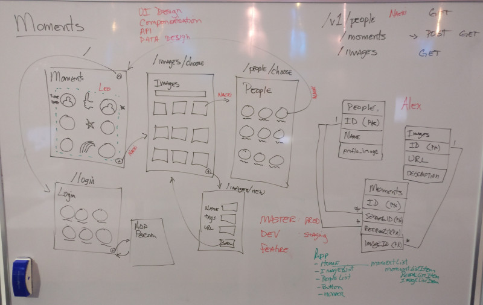

# Moments

Moments allows team members to send quick expressions, moments, to other team members. Each moment is public so the team can celebrate their moments together.


## Setup

```sh
git clone https://github.com/matai-2016/moments.git
cd moments && npm install
npm run knex migrate:latest
npm run knex seed:run
nmp test
npm start
open http://localhost:3000
```

## Data model


## Initial design



